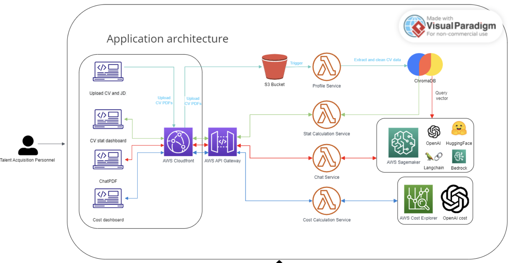

## Backend

-   Folder structures:

```
backend
├── chat-service/
├── api-gateway/
├── auth-service/
├── profile-service/

├── recommendation/
```

-   Folder [chat-service](./chat-service): containing the RAG (Retrieval-Augmented Generation) system used to retrieve relevant legal entries and knowledge related to the user's question. From that context, it will pass through a language model to generate the answer.
-   [api-gateway](./api-gateway): API Gateway for the system
-   [auth-service](./system/auth-service): service for authenticating user
-   [profile-service](./system/profile-service): service containing APIs for managing CV profile data 
-   [profile-service](./system/profile-service): service containing APIs for managing CV profile data 

## Architecture

Design as a microservice architecture as below:




